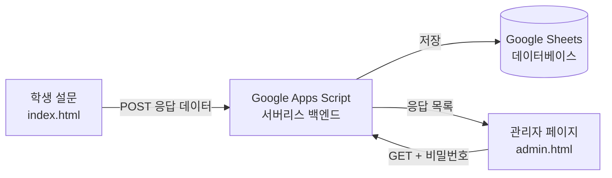
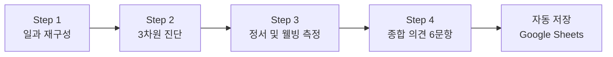

# 📋 DRM 설문 — 일상재구성법 기반 고교생 진로 진단

> **Day Reconstruction Method (DRM) Survey for High School Students**  
> 정보(Information) · 시간(Time) · 기회(Opportunity) 렌즈를 통한 일상 진단 도구

[](LICENSE)
[](index.html)
[](#)
[](#)
[](https://edu-data.github.io/DRM/)

---

## 🎯 연구 목적

본 연구는 **DRM(일상재구성법)** 의 시계열 데이터를 활용하여, 고교생의 일상을 **정보·시간·기회** 세 가지 렌즈로 재구성하고 진단합니다.

| 분석 차원 | DRM 측정 내용 | 웰빙 연계 |
|-----------|-------------|-----------|
| **📡 정보** | 진로 정보 접촉 빈도, 정보원, 신뢰도 | 정보 부족 → 불안감 vs 자기효능감 |
| **⏳ 시간** | 학습·여가·진로 탐색 시간 배분, 압박감 | 경쟁 스트레스 vs 몰입(Flow) 경험 |
| **🚪 기회** | 과목 선택, 전공 변경, 교육 인프라 접근 | 제도적 무력감 vs 자율성 |

### 핵심 연구 질문

- **정보 사막 (Information Deserts):** 탈전통적 학생·농산어촌 학생의 진로 정보 노출 빈도 격차
- **시간의 비대칭성:** 입시 압박 vs 방치·무의미한 대기의 양극화
- **기회 인식의 장벽:** 고교학점제 등 유연 교육과정 내 심리적/제도적 기회 인식 차이

---

## 🖥️ 설문 도구 소개

서버 없이 **브라우저만으로 동작**하는 SPA(Single Page Application) 설문입니다.  
응답 데이터는 **Google Apps Script**를 통해 **Google Sheets**에 자동 수집됩니다.

### 설문 구조 (3-Part, 6개 종합 의견 문항)

```
PART 1. 오늘의 일과 재구성 (Diary Construction)
   └─ 10~15개 에피소드 구분 (시간, 활동, 장소, 동행인)

PART 2. 에피소드별 심층 진단 (PERMA Well-being & 3-Lens)
   ├─ 📡 정보: 진로 정보 획득 여부 + 정보원 (다중선택 체크박스)
   ├─ ⏳ 시간: 압박 / 무의미 / 몰입 진단
   ├─ 🚪 기회: 선택 주체성 + 제도적 유연성
   └─ 💜 PERMA 웰빙: P(긍정정서)·E(몰입)·R(관계)·M(의미)·A(성취)·N(부정정서) (7점 척도 × 하위요인당 3문항 = 18문항)

PART 3. 종합 의견 (Global Reflection) — 6문항
   ├─ Q1. 가장 큰 장벽 (정보/시간/기회)
   ├─ Q2. 정보 접근성 (Likert 7점 × 4문항)
   ├─ Q3. 정보 획득 채널 (다중선택 체크박스)
   ├─ Q4. 시간 활용도 (Likert 7점 × 4문항)
   ├─ Q5. 기회 접근성 (Likert 7점 × 4문항)
   └─ Q6. 이상적인 하루 서술 (개방형)
```

### 주요 기능

| 기능 | 설명 |
|------|------|
| 🎨 프리미엄 UI | 다크 글래스모피즘 · 보라-청록 그라데이션 테마 |
| 📱 반응형 디자인 | 모바일 · 태블릿 · PC 모두 지원 |
| 🎚️ 7점 척도 슬라이더 | 웰빙 감정 및 Likert 측정 |
| ☑️ 다중선택 체크박스 | 정보원 선택 (교과/담임/진로상담교사, 부모님, 친구, SNS, ChatGPT, Gemini, Claude, 기타 AI 등 15개 항목) |
| 💾 자동 중간 저장 | localStorage 기반 이탈 복원 |
| ☁️ Google Sheets 수집 | Google Apps Script 자동 저장 (3개 시트) |
| 🔒 관리자 대시보드 | 비밀번호 보호, 응답 조회 · CSV/JSON 다운로드 |
| 📊 데이터 내보내기 | JSON / CSV 형식 로컬 다운로드 (백업) |

---

## 🚀 사용 방법

### 즉시 실행 (GitHub Pages)

🔗 **<https://edu-data.github.io/DRM/>**

### 로컬 실행

```bash
# 별도 설치 없이 index.html을 브라우저에서 열기
start index.html        # Windows
open index.html         # macOS
xdg-open index.html     # Linux
```

### 관리자 페이지

```
admin.html → 비밀번호 입력 → 전체 응답 조회 · CSV/JSON 다운로드
```

---

## ☁️ 백엔드 아키텍처


```mermaid
flowchart LR
  A[학생 설문<br/>index.html] -->|POST 응답 데이터| B[Google Apps Script<br/>서버리스 백엔드]
  B -->|저장| C[(Google Sheets<br/>데이터베이스)]
  D[관리자 페이지<br/>admin.html] -->|GET + 비밀번호| B
  B -->|응답 목록| D
```

- **학생**: 설문 완료 시 → 자동으로 Google Sheets에 저장 (3개 시트)
- **관리자**: `admin.html` 접속 → 비밀번호 입력 → 전체 응답 조회/다운로드
- **비용**: 무료 (Google Apps Script 무료 티어)

### Google Sheets 데이터 구조

| 시트 | 내용 | 컬럼 수 |
|------|------|---------|
| **Responses** | 종합 응답 (Likert + 개방형) | 20 |
| **Episodes** | 에피소드별 상세 기록 (시간, 활동, 장소, 동행인) | 7 |
| **Diagnoses** | 심층 진단 기록 (정보·정보원·시간·기회·PERMA 웰빙 18문항) | 27 |

---

## 📁 프로젝트 구조

```
DRM/
├── index.html          # SPA 엔트리포인트 (설문 전체)
├── admin.html          # 관리자 대시보드 (비밀번호 보호)
├── css/
│   ├── style.css       # 다크 글래스모피즘 디자인 시스템
│   └── admin.css       # 관리자 페이지 스타일
├── js/
│   ├── app.js          # 설문 애플리케이션 로직
│   ├── admin.js        # 관리자 데이터 조회/다운로드
│   └── config.js       # GAS 엔드포인트 및 설정
├── gas/
│   └── Code.gs         # Google Apps Script 백엔드 (배포용)
├── LICENSE
└── README.md
```

---

## 📊 기본 에피소드 템플릿 (경기도 고등학교 기준, 10개)

| # | 시간 | 활동 |
|---|------|------|
| 1 | 08:20~08:50 | 등교 및 조례 |
| 2 | 09:00~09:50 | 1교시 수업 |
| 3 | 10:00~10:50 | 2교시 수업 |
| 4 | 11:00~11:50 | 3교시 수업 |
| 5 | 12:00~12:50 | 4교시 수업 |
| 6 | 12:50~13:40 | 점심시간 |
| 7 | 13:40~15:20 | 5~6교시 수업 |
| 8 | 15:30~16:30 | 7교시 수업 |
| 9 | 16:30~18:00 | 방과 후 활동 / 자율학습 |
| 10 | 18:00~19:00 | 귀가 및 저녁식사 |

> 학생은 자신의 실제 일과에 맞게 에피소드를 수정·추가·삭제할 수 있습니다.

---

## 🔬 연구 대상 및 표집

### 참여 학교 (4개교)

| 구분 | 수도권 | 비수도권 |
|------|---------|----------|
| **일반고** | 동탄고 (허동구) | 충북 괴산고 (정혜진) |
| | 2안) 수성고 | 2안) 횡성고 (최소현) |
| **특성화고** | 광주중앙고 (안준범) | 홍천농고 (이루리, 김성수) |
| | 2안) | 2안) |

### 참여 학생

| 항목 | 내용 |
|------|------|
| **인원** | 4개교 × 2개 학년(1, 2학년) × 5명 = **총 40명** |
| **학교당** | 1학년 5명 + 2학년 5명 = 10명 |
| **대상 기준** | 응답을 성실히 해줄 학생 (진로결정 학생 + 진로미결정 학생) |
| **학생 참여비** | 개인당 4만원 |
| **섭외 교사** | 4명 (줄 회의 1회, 15만원) |

### 표집 설계

| 집단 | 특성 |
|------|------|
| **집단 1** (전통적) | 일반고 재학, 대입 준비 위주, 도시 지역 |
| **집단 2** (탈전통적) | 느린 학습자, 학업 중단 위기, 특성화고 전공 부적응, 저소득층/한부모 가정 |
| **지역 변인** | 수도권 (정보 과잉) vs 농산어촌 (정보 사막) |

---

## 📊 데이터 수집 일정 및 절차

### 연구 일정 (2026년 3월 말 ~ 6월)

| 회차 | 기간 | 비고 |
|------|------|------|
| **1회차** | 3.30 ~ 4.3 (월/수/금) | 3회 응답 |
| **2회차** | 4.20 ~ 4.24 (월/수/금) | 3회 응답 |
| **3회차** | 5.18 ~ 5.22 (월/수/금) | 3회 응답 |
| **4회차** | 6.22 ~ 6.26 (월/수/금) | 3회 응답 |

> **학생 당 총 응답 횟수:** 월 1회 × 주 3회 × 4개월 = **12회**

### 수집 절차


```mermaid
flowchart LR
  A[Step 1<br/>일과 재구성] --> B[Step 2<br/>3차원 진단]
  B --> C[Step 3<br/>정서 및 웰빙 측정]
  C --> D[Step 4<br/>종합 의견 6문항]
  D --> E[자동 저장<br/>Google Sheets]
```

1. **Step 1 — 일과 재구성:** 오늘 하루 일과를 10~15개 에피소드로 구분
2. **Step 2 — 3차원 진단:** 각 에피소드에 정보·시간·기회 진단
3. **Step 3 — 웰빙 측정:** PERMA-Profiler (Butler & Kern, 2016) 기반 18문항 7점 척도
4. **Step 4 — 종합 의견:** 6개 문항으로 정보·시간·기회 종합 평가 (모두 오늘 경험 기반 state 측정)

---

## 📝 정책 제언 방향

| 영역 | 제언 |
|------|------|
| **정보의 민주화** | 디지털 진로 정보 큐레이션, 지역 연계 멘토링 |
| **유연한 시간 설계** | 보충·도약의 시간 공식화, 전공 변경 골든타임 확보 |
| **기회 구조 재설계** | 관심도 중심 진로 선택제, 대학 연계 개방형 학습경로 |

---

## 🛠️ 기술 스택

| 구분 | 기술 |
|------|------|
| 구조 | HTML5 Semantic Elements |
| 스타일 | Vanilla CSS (글래스모피즘, CSS 변수) |
| 로직 | Vanilla JavaScript (ES6+) |
| 폰트 | Noto Sans KR (Google Fonts) |
| 백엔드 | Google Apps Script (서버리스) |
| 데이터베이스 | Google Sheets (3개 시트) |
| 로컬 저장 | localStorage API |
| 내보내기 | Blob API (JSON/CSV) |
| 배포 | GitHub Pages |
| GAS 배포 | clasp CLI (Google Apps Script CLI) |

---

## 📌 버전 변경 이력

### v1.5 — 2026-03-16 (AI 정보원 추가 및 시점 통일)

- **Q3 정보원에 AI 도구 4개 항목 추가**: ChatGPT, Gemini, Claude, 기타 AI (Copilot, Grok, 뤼튼 등)
- **시점 통일**: 전체 설문에서 "어제" → "오늘"로 변경 (당일 경험 state 측정)
- Google Sheets 헤더 및 GAS 배포 동기화 (Version 6)

### v1.4 — 2026-03-16 (측정학적 포괄 검토 및 문항 교정)

- **측정학적 포괄 검토**: 신뢰도, 타당도 (내용/구인/변별), 공정성, DIF 관점 전수 검토
- **교정된 문항:**
  - M3: "방향감을 가지고 참여했다" → "이 활동을 왜 하는지 알고 있었다" (고교생 적합성↑)
  - infoAccess3: 역문항 → 정문항 전환 ("찾을 수 없었다" → "쉽게 찾을 수 있었다")
  - infoAccess4: 호기심 → 정보 접근 측정 ("호기심이 생겼다" → "궁금증을 해소할 수 있었다")
  - timeUse2: 역문항 → 정문항 ("시간에 쫓겼다" → "충분한 여유 시간이 있었다")
  - timeUse3: 역문항 → 정문항 ("의미 없이 흘려보냈다" → "의미 있게 사용했다")
  - timeUse4: 자율성 → 계획 실행 분화 ("원하는 대로" → "계획한 대로")
  - oppAccess2: 역문항 → 정문항 ("제약 때문에 시도 못했다" → "새로운 것을 시도할 수 있었다")

### v1.3 — 2026-03-16 (PERMA-Profiler 기반 문항 교체)

- **PERMA 18문항을 Butler & Kern (2016) PERMA-Profiler 원문 기반으로 교체**
  - P: 기쁨(joyful) / 긍정적 기분(positive) / 만족감(contented)
  - E: 빠져들었다(absorbed) / 시간무감(lost track of time) / 흥미와 관심(excited & interested)
  - R: 도움과 지지(help & support) / 사랑받음(loved) / 관계 만족(satisfied with relationships)
  - M: 의미+목적(purposeful & meaningful) / 가치(valuable & worthwhile) / 목적 이해(knew why)
  - A: 목표 진전(making progress) / 목표 달성(achieve goals) / 책임 수행(handle responsibilities)
  - N: 불안(anxious) / 화남(angry) / 슬픔(sad)

### v1.2 — 2026-03-16 (정보·기회 문항 경험 기반 전환)

- Q2 정보 접근성: 3문항 → 4문항으로 확장, state 측정으로 전환
- Q5 기회 인식: 4문항 모두 state 측정 전환
- Q4 시간 활용도: trait → state 측정 전환, PERMA E와의 중복 제거

### v1.1 — 2026-03-16 (신뢰도·타당도 기반 문항 개선)

- 이중 질문(double-barreled) 해소, 구인 오염 제거, 문항 간 중복 해소
- 역방향 문항 정방향 통일 (infoAccess3)
- 추상적 문항 구체화 (A1, oppAccess3, oppAccess4)

### v1.0 — 2026-03-16 (초기 구조 개편)

- PERMA 웰빙: 하위요인당 1문항 → 3문항으로 확장 (6 → 18문항)
- PART 3 "종합 진단 및 의견" → "종합 의견"으로 개명
- Q4(정보사막), Q6(시간설계), Q8(기회구조), Q9(전반적 PERMA) 삭제
- 설문 안내문 간소화
- 5대 가치 관련 문항 삭제

---

## 📋 문항 매트릭스 (v1.5 기준)

### PART 3 — 종합 의견 문항 상세

| 구분 | ID | 문항 내용 | 척도 |
|------|----|-----------|------|
| **Q1** | barrier | 오늘 가장 큰 장벽 (정보/시간/기회) | 단일선택 |
| **Q2** | infoAccess1 | 오늘 진로에 대한 새로운 정보를 얻은 경험이 있었다 | 7점 Likert |
| | infoAccess2 | 오늘 얻은 진로 정보가 나에게 실질적으로 도움이 되었다 | 7점 Likert |
| | infoAccess3 | 오늘 필요한 진로 정보를 쉽게 찾을 수 있었다 | 7점 Likert |
| | infoAccess4 | 오늘 진로에 관한 궁금증을 해소할 수 있었다 | 7점 Likert |
| **Q3** | infoSources | 주요 진로 정보원 (15개 항목 다중선택) | 체크박스 |
| **Q4** | timeUse1 | 나는 오늘 하루 일과를 주도적으로 운영했다 | 7점 Likert |
| | timeUse2 | 오늘 나에게 충분한 여유 시간이 있었다 | 7점 Likert |
| | timeUse3 | 오늘 나의 시간을 의미 있게 사용했다 | 7점 Likert |
| | timeUse4 | 오늘 계획한 대로 시간을 사용할 수 있었다 | 7점 Likert |
| **Q5** | oppAccess1 | 오늘 내가 원하는 과목이나 활동을 선택할 수 있었다 | 7점 Likert |
| | oppAccess2 | 오늘 진로와 관련하여 새로운 것을 시도할 수 있었다 | 7점 Likert |
| | oppAccess3 | 오늘 진로 탐색에 도움이 될 만한 체험이나 기회가 있었다 | 7점 Likert |
| | oppAccess4 | 오늘 나의 관심·적성에 맞는 활동을 할 수 있었다 | 7점 Likert |
| **Q6** | idealDay | 나의 이상적인 하루 서술 | 개방형 |

### Q3 정보원 선택지 (15개)

| # | 값 | 라벨 |
|---|-----|------|
| 1 | 교과선생님 | 교과선생님 |
| 2 | 담임선생님 | 담임선생님 |
| 3 | 진로상담교사 | 진로상담교사 |
| 4 | 부모님/보호자 | 부모님/보호자 |
| 5 | 형제·자매 | 형제·자매 |
| 6 | 친구·선후배 | 친구·선후배 |
| 7 | 학원 강사 | 학원 강사 |
| 8 | 유튜브/SNS | 유튜브/SNS |
| 9 | 온라인 커뮤니티 | 온라인 커뮤니티 (오르비, 수만휘 등) |
| 10 | 대학 입학처 홈페이지 | 대학 입학처 홈페이지 |
| 11 | 진로 정보 앱/사이트 | 진로 정보 앱/사이트 (커리어넷 등) |
| 12 | ChatGPT | ChatGPT |
| 13 | Gemini | Gemini |
| 14 | Claude | Claude |
| 15 | 기타 AI | 기타 AI (Copilot, Grok, 뤼튼 등) |

---

## 📄 라이선스

MIT License

---

<p align="center">
  <strong>일상재구성법(DRM) 기반 고교생 진로 진단 연구</strong><br/>
  <em>정보 · 시간 · 기회 — 세 가지 렌즈로 일상을 재구성합니다</em>
</p>
