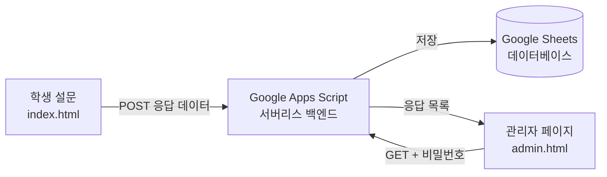
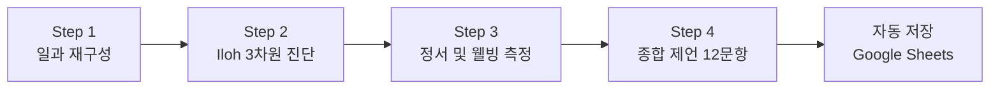

# 📋 DRM 설문 — 일상재구성법 기반 고교생 진로 진단

> **Day Reconstruction Method (DRM) Survey for High School Students**  
> 정보(Information) · 시간(Time) · 기회(Opportunity) 렌즈를 통한 일상 진단 도구

[](LICENSE)
[](index.html)
[](#)
[](#)
[](https://edu-data.github.io/DRM/)

---

## 🎯 연구 목적

본 연구는 **Iloh의 생태학적 진로 궤적 모델**과 **DRM(일상재구성법)** 의 시계열 데이터를 결합하여, 고교생의 일상을 **정보·시간·기회** 세 가지 렌즈로 재구성하고 진단합니다.

| 분석 차원 | DRM 측정 내용 | 웰빙 연계 |
|-----------|-------------|-----------|
| **📡 정보** | 진로 정보 접촉 빈도, 정보원, 신뢰도 | 정보 부족 → 불안감 vs 자기효능감 |
| **⏳ 시간** | 학습·여가·진로 탐색 시간 배분, 압박감 | 경쟁 스트레스 vs 몰입(Flow) 경험 |
| **🚪 기회** | 과목 선택, 전공 변경, 교육 인프라 접근 | 제도적 무력감 vs 자율성 |

### 핵심 연구 질문

- **정보 사막 (Information Deserts):** 탈전통적 학생·농산어촌 학생의 진로 정보 노출 빈도 격차
- **시간의 비대칭성:** 입시 압박 vs 방치·무의미한 대기의 양극화
- **기회 인식의 장벽:** 고교학점제 등 유연 교육과정 내 심리적/제도적 기회 인식 차이

---

## 🖥️ 설문 도구 소개

서버 없이 **브라우저만으로 동작**하는 SPA(Single Page Application) 설문입니다.  
응답 데이터는 **Google Apps Script**를 통해 **Google Sheets**에 자동 수집됩니다.

### 설문 구조 (3-Part, 12개 종합 진단 문항)

```
PART 1. 어제의 일과 재구성 (Diary Construction)
   └─ 10~15개 에피소드 분절 (시간, 활동, 장소, 동행인)

PART 2. 에피소드별 심층 진단 (Iloh & Well-being)
   ├─ 📡 정보: 진로 정보 획득 여부 + 정보원
   ├─ ⏳ 시간: 압박 / 무의미 / 몰입 진단
   ├─ 🚪 기회: 선택 주체성 + 제도적 유연성
   └─ 💜 웰빙: 즐거움·자신감·불안함·지루함 (7점 척도)

PART 3. 종합 진단 및 제언 (Global Reflection) — 12문항
   ├─ Q1. 가장 큰 장벽 (정보/시간/기회)
   ├─ Q2. 정보 접근성 (Likert 7점 × 3문항)
   ├─ Q3. 정보 획득 채널 (다중선택 체크박스)
   ├─ Q4. 정보 사막 체감 경험 (개방형)
   ├─ Q5. 시간 활용도 (Likert 7점 × 4문항)
   ├─ Q6. 시간 설계 자유 제안 (개방형)
   ├─ Q7. 기회 접근성 (Likert 7점 × 4문항)
   ├─ Q8. 기회 구조 개선 제안 (개방형)
   ├─ Q9. 전반적 웰빙 (Likert 7점 × 6문항)
   ├─ Q10. 정책 우선순위 순위 매기기
   ├─ Q11. 학교에 바라는 한 마디 (개방형)
   └─ Q12. 이상적인 하루 서술 (개방형)
```

### 주요 기능

| 기능 | 설명 |
|------|------|
| 🎨 프리미엄 UI | 다크 글래스모피즘 · 보라-청록 그라데이션 테마 |
| 📱 반응형 디자인 | 모바일 · 태블릿 · PC 모두 지원 |
| 🎚️ 7점 척도 슬라이더 | 웰빙 감정 및 Likert 측정 |
| 💾 자동 중간 저장 | localStorage 기반 이탈 복원 |
| ☁️ Google Sheets 수집 | Google Apps Script 자동 저장 (32개 컬럼) |
| 🔒 관리자 대시보드 | 비밀번호 보호, 응답 조회 · CSV/JSON 다운로드 |
| 📊 데이터 내보내기 | JSON / CSV 형식 로컬 다운로드 (백업) |

---

## 🚀 사용 방법

### 즉시 실행 (GitHub Pages)

🔗 **<https://edu-data.github.io/DRM/>**

### 로컬 실행

```bash
# 별도 설치 없이 index.html을 브라우저에서 열기
start index.html        # Windows
open index.html         # macOS
xdg-open index.html     # Linux
```

### 관리자 페이지

```
admin.html → 비밀번호 입력 → 전체 응답 조회 · CSV/JSON 다운로드
```

---

## ☁️ 백엔드 아키텍처



- **학생**: 설문 완료 시 → 자동으로 Google Sheets에 저장 (3개 시트)
- **관리자**: `admin.html` 접속 → 비밀번호 입력 → 전체 응답 조회/다운로드
- **비용**: 무료 (Google Apps Script 무료 티어)

### Google Sheets 데이터 구조

| 시트 | 내용 | 컬럼 수 |
|------|------|---------|
| **Responses** | 종합 응답 (Likert + 개방형 + 정책 순위) | 32 (A~AF) |
| **Episodes** | 에피소드별 상세 기록 (시간, 활동, 장소, 동행인) | 7 |
| **Diagnoses** | 심층 진단 기록 (정보·시간·기회·웰빙 슬라이더) | 12 |

---

## 📁 프로젝트 구조

```
DRM/
├── index.html          # SPA 엔트리포인트 (설문 전체)
├── admin.html          # 관리자 대시보드 (비밀번호 보호)
├── css/
│   ├── style.css       # 다크 글래스모피즘 디자인 시스템
│   └── admin.css       # 관리자 페이지 스타일
├── js/
│   ├── app.js          # 설문 애플리케이션 로직
│   ├── admin.js        # 관리자 데이터 조회/다운로드
│   └── config.js       # GAS 엔드포인트 및 설정
├── gas/
│   └── Code.gs         # Google Apps Script 백엔드 (배포용)
├── LICENSE
└── README.md
```

---

## 📊 기본 에피소드 템플릿 (경기도 고등학교 기준)

| # | 시간 | 활동 |
|---|------|------|
| 1 | 07:30~08:20 | 기상 및 등교 |
| 2 | 08:20~08:50 | 등교 및 조례 |
| 3 | 09:00~09:50 | 1교시 수업 |
| 4 | 10:00~10:50 | 2교시 수업 |
| 5 | 11:00~11:50 | 3교시 수업 |
| 6 | 12:00~12:50 | 4교시 수업 |
| 7 | 12:50~13:40 | 점심시간 |
| 8 | 13:40~15:20 | 5~6교시 수업 |
| 9 | 15:30~16:30 | 7교시 수업 |
| 10 | 16:30~18:00 | 방과 후 활동 / 자율학습 |
| 11 | 18:00~19:00 | 귀가 및 저녁식사 |
| 12 | 19:00~23:00 | 자기주도학습 / 자유시간 |

> 학생은 자신의 실제 일과에 맞게 에피소드를 수정·추가·삭제할 수 있습니다.

---

## 🔬 연구 대상 및 표집

| 집단 | 특성 |
|------|------|
| **집단 1** (전통적) | 일반고 재학, 대입 준비 위주, 도시 지역 |
| **집단 2** (탈전통적) | 느린 학습자, 학업 중단 위기, 특성화고 전공 부적응, 저소득층/한부모 가정 |
| **지역 변인** | 수도권 (정보 과잉) vs 농산어촌 (정보 사막) |

---

## 📊 데이터 수집 절차



1. **Step 1 — 일과 재구성:** 전날 일과를 10~15개 에피소드로 분절
2. **Step 2 — Iloh 3차원 적용:** 각 에피소드에 정보·시간·기회 진단
3. **Step 3 — 웰빙 측정:** 긍정/부정 정서 7점 척도 기록
4. **Step 4 — 종합 제언:** 12개 문항으로 정보·시간·기회·웰빙·정책 종합 평가

---

## 📝 정책 제언 방향

| 영역 | 제언 |
|------|------|
| **정보의 민주화** | 디지털 진로 정보 큐레이션, 지역 연계 멘토링 |
| **유연한 시간 설계** | 보충·도약의 시간 공식화, 전공 변경 골든타임 확보 |
| **기회 구조 재설계** | 관심도 중심 진로 선택제, 대학 연계 개방형 학습경로 |

---

## 🛠️ 기술 스택

| 구분 | 기술 |
|------|------|
| 구조 | HTML5 Semantic Elements |
| 스타일 | Vanilla CSS (글래스모피즘, CSS 변수) |
| 로직 | Vanilla JavaScript (ES6+) |
| 폰트 | Noto Sans KR (Google Fonts) |
| 백엔드 | Google Apps Script (서버리스) |
| 데이터베이스 | Google Sheets (3개 시트) |
| 로컬 저장 | localStorage API |
| 내보내기 | Blob API (JSON/CSV) |
| 배포 | GitHub Pages |

---

## 📄 라이선스

MIT License

---

<p align="center">
  <strong>일상재구성법(DRM) 기반 고교생 진로 진단 연구</strong><br/>
  <em>Iloh & DRM 통합 모델 · 정보 · 시간 · 기회</em>
</p>
