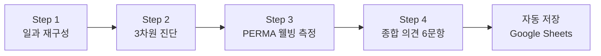

# DRM 조사설계(안)

> **일상재구성법(Day Reconstruction Method) 기반 고교생 진로 진단 연구**  
> 정보(Information) · 시간(Time) · 기회(Opportunity) 렌즈를 통한 일상 진단

---

## 1. 연구 목적

본 연구는 **DRM(일상재구성법)** 을 활용하여, 고교생의 일상을 **정보·시간·기회** 세 가지 렌즈로 재구성하고, 진로 관련 경험과 웰빙의 관계를 종단적으로 분석한다.

### 핵심 연구 질문

| RQ | 연구 질문 |
|----|---------|
| **RQ1** | 정보 사막(Information Deserts): 탈전통적 학생·농산어촌 학생의 진로 정보 노출 빈도 격차는 어떠한가? |
| **RQ2** | 시간의 비대칭성: 입시 압박 vs 방치·무의미한 대기의 양극화 양상은 어떠한가? |
| **RQ3** | 기회 인식의 장벽: 고교학점제 등 유연 교육과정 내 심리적/제도적 기회 인식 차이는 어떠한가? |

---

## 2. 연구 대상

### 2.1 참여 학교 (4개교)

| 구분 | 수도권 | 비수도권 |
|------|---------|----------|
| **일반고** | 동탄고 (허동구) | 충북 괴산고 (정혜진) |
| | 2안) 수성고 | 2안) 횡성고 (최소현) |
| **특성화고** | 광주중앙고 (안준범) | 홍천농고 (이루리, 김성수) |

### 2.2 참여 학생

| 항목 | 내용 |
|------|------|
| **총 인원** | 4개교 × 2개 학년(1, 2학년) × 5명 = **40명** |
| **학교당** | 1학년 5명 + 2학년 5명 = 10명 |
| **대상 기준** | 응답을 성실히 해줄 학생 (진로결정 학생 + 진로미결정 학생 혼합) |
| **학생 참여비** | 개인당 4만원 |

### 2.3 섭외 교사

| 항목 | 내용 |
|------|------|
| **인원** | 4명 (학교당 1명) |
| **사례비** | 15만원 (줌 회의 1회 포함) |

### 2.4 표집 설계 (2×2 설계)

```
                  수도권 (정보 과잉)    비수도권 (정보 사막)
  ┌─────────────┬──────────────────┬──────────────────┐
  │ 일반고      │ 동탄고 (10명)    │ 괴산고 (10명)    │
  │ (전통적)    │                  │                  │
  ├─────────────┼──────────────────┼──────────────────┤
  │ 특성화고    │ 광주중앙고 (10명)│ 홍천농고 (10명)  │
  │ (탈전통적)  │                  │                  │
  └─────────────┴──────────────────┴──────────────────┘
                         총 40명
```

| 집단 | 특성 |
|------|------|
| **집단 1** (전통적) | 일반고 재학, 대입 준비 위주 |
| **집단 2** (탈전통적) | 느린 학습자, 학업 중단 위기, 특성화고 전공 부적응, 저소득층/한부모 가정 |
| **지역 변인** | 수도권 (정보 과잉) vs 농산어촌 (정보 사막) |

---

## 3. 연구 일정

### 3.1 데이터 수집 기간

**2026년 3월 말 ~ 6월**, 월 1주간 × 주 3회(월/수/금) × 4개월

| 회차 | 기간 | 요일 | 응답 횟수 |
|------|------|------|-----------|
| **1회차** | 3.30 (월) ~ 4.3 (금) | 월·수·금 | 3회 |
| **2회차** | 4.20 (월) ~ 4.24 (금) | 월·수·금 | 3회 |
| **3회차** | 5.18 (월) ~ 5.22 (금) | 월·수·금 | 3회 |
| **4회차** | 6.22 (월) ~ 6.26 (금) | 월·수·금 | 3회 |

> **학생 당 총 응답 횟수:** 3회/주 × 4개월 = **12회**  
> **총 데이터 포인트:** 40명 × 12회 = **480 응답**

### 3.2 전체 연구 타임라인

```
2026년
  3월  ▓▓░░  IRB 승인 · 섭외 교사 줌 회의 · 학생 모집
  3/30 ████  1회차 데이터 수집 (월·수·금)
  4월  ░░░░  중간 데이터 점검
  4/20 ████  2회차 데이터 수집 (월·수·금)
  5월  ░░░░  중간 분석
  5/18 ████  3회차 데이터 수집 (월·수·금)
  6월  ░░░░  최종 수집 준비
  6/22 ████  4회차 데이터 수집 (월·수·금)
  7월  ▓▓▓▓  데이터 분석 · 논문 집필
```

---

## 4. 측정 도구

### 4.1 설문 구조 (3-Part)

| PART | 내용 | 문항 수 |
|------|------|---------|
| **PART 1** | 오늘의 일과 재구성 (Diary Construction) | 10~15 에피소드 |
| **PART 2** | 에피소드별 심층 진단 (3-Lens + PERMA) | 에피소드당 23문항 |
| **PART 3** | 종합 의견 (Global Reflection) | 6문항 (Q1~Q6) |

### 4.2 PART 2 — 에피소드별 3차원 진단 + PERMA 웰빙

| 렌즈 | 측정 내용 | 문항 유형 |
|------|----------|-----------|
| 📡 **정보** | 진로 정보 획득 여부 + 정보원 | 단일선택 + 체크박스 |
| ⏳ **시간** | 시간 압박/무의미/몰입/주도적 활용 | 단일선택 |
| 🚪 **기회** | 선택 주체성 + 제도적 유연성 | 단일선택 × 2 |

**PERMA 웰빙 (Butler & Kern, 2016 PERMA-Profiler 기반, 7점 척도)**

| 하위요인 | ID | 문항 |
|----------|-----|------|
| **P** 긍정정서 | P1 | 이 활동 중 기쁨을 느꼈다 |
| | P2 | 이 활동 중 긍정적인 기분이었다 |
| | P3 | 이 활동 중 만족감을 느꼈다 |
| **E** 몰입 | E1 | 이 활동에 완전히 빠져들었다 |
| | E2 | 시간 가는 줄 모를 정도로 집중했다 |
| | E3 | 이 활동에 흥미와 관심을 느꼈다 |
| **R** 관계 | R1 | 필요할 때 도움과 지지를 받을 수 있었다 |
| | R2 | 사랑받고 있다고 느꼈다 |
| | R3 | 함께한 사람들과의 관계가 만족스러웠다 |
| **M** 의미 | M1 | 이 활동이 의미 있고 목적이 있었다 |
| | M2 | 이 활동이 가치 있는 일이라고 느꼈다 |
| | M3 | 이 활동을 왜 하는지 알고 있었다 |
| **A** 성취 | A1 | 목표를 향해 진전하고 있다고 느꼈다 |
| | A2 | 중요한 목표를 이루어 냈다고 느꼈다 |
| | A3 | 해야 할 일을 잘 해낼 수 있었다 |
| **N** 부정정서 | N1 | 불안함을 느꼈다 |
| | N2 | 화가 났다 |
| | N3 | 슬픔을 느꼈다 |

### 4.3 PART 3 — 종합 의견 문항 (오늘 경험 기반 state 측정)

| Q | ID | 문항 내용 | 척도 |
|---|-----|-----------|------|
| **Q1** | barrier | 오늘 가장 큰 장벽 (정보/시간/기회) | 단일선택 |
| **Q2** | infoAccess1 | 오늘 진로에 대한 새로운 정보를 얻은 경험이 있었다 | 7점 Likert |
| | infoAccess2 | 오늘 얻은 진로 정보가 나에게 실질적으로 도움이 되었다 | 7점 Likert |
| | infoAccess3 | 오늘 필요한 진로 정보를 쉽게 찾을 수 있었다 | 7점 Likert |
| | infoAccess4 | 오늘 진로에 관한 궁금증을 해소할 수 있었다 | 7점 Likert |
| **Q3** | infoSources | 주요 진로 정보원 (15개 항목 다중선택) | 체크박스 |
| **Q4** | timeUse1 | 나는 오늘 하루 일과를 주도적으로 운영했다 | 7점 Likert |
| | timeUse2 | 오늘 나에게 충분한 여유 시간이 있었다 | 7점 Likert |
| | timeUse3 | 오늘 나의 시간을 의미 있게 사용했다 | 7점 Likert |
| | timeUse4 | 오늘 계획한 대로 시간을 사용할 수 있었다 | 7점 Likert |
| **Q5** | oppAccess1 | 오늘 내가 원하는 과목이나 활동을 선택할 수 있었다 | 7점 Likert |
| | oppAccess2 | 오늘 진로와 관련하여 새로운 것을 시도할 수 있었다 | 7점 Likert |
| | oppAccess3 | 오늘 진로 탐색에 도움이 될 만한 체험이나 기회가 있었다 | 7점 Likert |
| | oppAccess4 | 오늘 나의 관심·적성에 맞는 활동을 할 수 있었다 | 7점 Likert |
| **Q6** | idealDay | 나의 이상적인 하루 서술 | 개방형 |

### 4.4 Q3 정보원 선택지 (15개)

| # | 항목 | 비고 |
|---|------|------|
| 1 | 교과선생님 | 인적 |
| 2 | 담임선생님 | 인적 |
| 3 | 진로상담교사 | 인적 |
| 4 | 부모님/보호자 | 인적 |
| 5 | 형제·자매 | 인적 |
| 6 | 친구·선후배 | 인적 |
| 7 | 학원 강사 | 인적 |
| 8 | 유튜브/SNS | 매체 |
| 9 | 온라인 커뮤니티 (오르비, 수만휘 등) | 매체 |
| 10 | 대학 입학처 홈페이지 | 매체 |
| 11 | 진로 정보 앱/사이트 (커리어넷 등) | 매체 |
| 12 | ChatGPT | AI |
| 13 | Gemini | AI |
| 14 | Claude | AI |
| 15 | 기타 AI (Copilot, Grok, 뤼튼 등) | AI |

### 4.5 전체 문항 일람표

| # | PART | 구성 | 변수명 | 문항 내용 | 척도 | 구인 |
|---|------|------|--------|----------|------|------|
| 1 | 1 | 에피소드 | startTime | 시작 시간 | 시간 입력 | 일과 |
| 2 | 1 | 에피소드 | endTime | 종료 시간 | 시간 입력 | 일과 |
| 3 | 1 | 에피소드 | activity | 활동 내용 | 텍스트 | 일과 |
| 4 | 1 | 에피소드 | location | 장소 | 텍스트 | 일과 |
| 5 | 1 | 에피소드 | companion | 동행인 | 텍스트 | 일과 |
| 6 | 2 | 정보 렌즈 | information | 이 활동 중 진로에 관한 정보를 얻었나요? | 4점 단일선택 | 정보 접촉 |
| 7 | 2 | 정보 렌즈 | informationSources | 정보를 어디서 얻었나요? | 다중선택 | 정보원 |
| 8 | 2 | 시간 렌즈 | time | 이 활동 중 시간을 어떻게 경험했나요? | 4점 단일선택 | 시간 경험 |
| 9 | 2 | 기회 렌즈 | opportunityChosen | 이 활동은 스스로 선택한 것인가요? | 2점 단일선택 | 선택 주체성 |
| 10 | 2 | 기회 렌즈 | opportunityFlexible | 다른 활동으로 바꿀 수 있었나요? | 2점 단일선택 | 제도적 유연성 |
| 11 | 2 | PERMA-P | P1 | 이 활동 중 기쁨을 느꼈다 | 7점 Likert | 긍정정서 |
| 12 | 2 | PERMA-P | P2 | 이 활동 중 긍정적인 기분이었다 | 7점 Likert | 긍정정서 |
| 13 | 2 | PERMA-P | P3 | 이 활동 중 만족감을 느꼈다 | 7점 Likert | 긍정정서 |
| 14 | 2 | PERMA-E | E1 | 이 활동에 완전히 빠져들었다 | 7점 Likert | 몰입 |
| 15 | 2 | PERMA-E | E2 | 시간 가는 줄 모를 정도로 집중했다 | 7점 Likert | 몰입 |
| 16 | 2 | PERMA-E | E3 | 이 활동에 흥미와 관심을 느꼈다 | 7점 Likert | 몰입 |
| 17 | 2 | PERMA-R | R1 | 필요할 때 도움과 지지를 받을 수 있었다 | 7점 Likert | 관계 |
| 18 | 2 | PERMA-R | R2 | 사랑받고 있다고 느꼈다 | 7점 Likert | 관계 |
| 19 | 2 | PERMA-R | R3 | 함께한 사람들과의 관계가 만족스러웠다 | 7점 Likert | 관계 |
| 20 | 2 | PERMA-M | M1 | 이 활동이 의미 있고 목적이 있었다 | 7점 Likert | 의미 |
| 21 | 2 | PERMA-M | M2 | 이 활동이 가치 있는 일이라고 느꼈다 | 7점 Likert | 의미 |
| 22 | 2 | PERMA-M | M3 | 이 활동을 왜 하는지 알고 있었다 | 7점 Likert | 의미 |
| 23 | 2 | PERMA-A | A1 | 목표를 향해 진전하고 있다고 느꼈다 | 7점 Likert | 성취 |
| 24 | 2 | PERMA-A | A2 | 중요한 목표를 이루어 냈다고 느꼈다 | 7점 Likert | 성취 |
| 25 | 2 | PERMA-A | A3 | 해야 할 일을 잘 해낼 수 있었다 | 7점 Likert | 성취 |
| 26 | 2 | PERMA-N | N1 | 불안함을 느꼈다 | 7점 Likert | 부정정서 |
| 27 | 2 | PERMA-N | N2 | 화가 났다 | 7점 Likert | 부정정서 |
| 28 | 2 | PERMA-N | N3 | 슬픔을 느꼈다 | 7점 Likert | 부정정서 |
| 29 | 3 | Q1 장벽 | barrier | 오늘 가장 큰 장벽 (정보/시간/기회) | 단일선택 | 장벽 인식 |
| 30 | 3 | Q2 정보접근 | infoAccess1 | 오늘 진로에 대한 새로운 정보를 얻은 경험이 있었다 | 7점 Likert | 정보 접근성 |
| 31 | 3 | Q2 정보접근 | infoAccess2 | 오늘 얻은 진로 정보가 나에게 실질적으로 도움이 되었다 | 7점 Likert | 정보 유용성 |
| 32 | 3 | Q2 정보접근 | infoAccess3 | 오늘 필요한 진로 정보를 쉽게 찾을 수 있었다 | 7점 Likert | 정보 탐색 용이성 |
| 33 | 3 | Q2 정보접근 | infoAccess4 | 오늘 진로에 관한 궁금증을 해소할 수 있었다 | 7점 Likert | 정보 충족성 |
| 34 | 3 | Q3 정보원 | infoSources | 주요 진로 정보원 (15개 항목) | 다중선택 | 정보원 유형 |
| 35 | 3 | Q4 시간 | timeUse1 | 나는 오늘 하루 일과를 주도적으로 운영했다 | 7점 Likert | 시간 자율성 |
| 36 | 3 | Q4 시간 | timeUse2 | 오늘 나에게 충분한 여유 시간이 있었다 | 7점 Likert | 시간 여유 |
| 37 | 3 | Q4 시간 | timeUse3 | 오늘 나의 시간을 의미 있게 사용했다 | 7점 Likert | 시간 의미성 |
| 38 | 3 | Q4 시간 | timeUse4 | 오늘 계획한 대로 시간을 사용할 수 있었다 | 7점 Likert | 시간 계획성 |
| 39 | 3 | Q5 기회 | oppAccess1 | 오늘 내가 원하는 과목이나 활동을 선택할 수 있었다 | 7점 Likert | 선택 자유도 |
| 40 | 3 | Q5 기회 | oppAccess2 | 오늘 진로와 관련하여 새로운 것을 시도할 수 있었다 | 7점 Likert | 시도 가능성 |
| 41 | 3 | Q5 기회 | oppAccess3 | 오늘 진로 탐색에 도움이 될 만한 체험이나 기회가 있었다 | 7점 Likert | 체험 기회 |
| 42 | 3 | Q5 기회 | oppAccess4 | 오늘 나의 관심·적성에 맞는 활동을 할 수 있었다 | 7점 Likert | 적성 부합 |
| 43 | 3 | Q6 이상적 | idealDay | 나의 이상적인 하루 서술 | 개방형 | 열정·지향 |

> **총 문항 수:** PART 1 (5항목 × 에피소드), PART 2 (23문항 × 선택 에피소드), PART 3 (15문항)

---

## 5. 데이터 수집 절차



1. **Step 1 — 일과 재구성:** 오늘 하루 일과를 10~15개 에피소드로 구분 (시간, 활동, 장소, 동행인)
2. **Step 2 — 3차원 진단:** 선택한 에피소드에 정보·시간·기회 렌즈 적용
3. **Step 3 — PERMA 웰빙:** Butler & Kern (2016) PERMA-Profiler 기반 18문항 (7점 척도)
4. **Step 4 — 종합 의견:** 6개 문항으로 정보·시간·기회 종합 평가 (오늘 경험 기반 state 측정)

---

## 6. 데이터 구조

| 시트 | 내용 | 컬럼 수 |
|------|------|---------|
| **Responses** | 종합 응답 (Likert + 개방형) | 20 |
| **Episodes** | 에피소드별 상세 기록 (시간, 활동, 장소, 동행인) | 7 |
| **Diagnoses** | 심층 진단 기록 (정보·정보원·시간·기회·PERMA 18문항) | 27 |

> 예상 총 데이터: Responses 480행, Episodes ~4,800행, Diagnoses ~1,920행

---

## 7. 분석 계획

### 7.1 기술 통계

- 집단별(학교유형 × 지역) PERMA 하위요인 평균 비교
- 정보원 선택 빈도 분석 (AI 활용도 포함)
- 시간/기회 인식 분포

### 7.2 종단 분석 (12회 반복측정)

- 다층 선형 모형(HLM): 에피소드(Level 1) → 일별(Level 2) → 학생(Level 3) → 학교(Level 4)
- 정보·시간·기회 경험이 PERMA 웰빙에 미치는 영향
- 시간에 따른 변화 추이 (4개월 종단)

### 7.3 집단 비교

- 전통적 vs 탈전통적 학생의 3차원 격차
- 수도권 vs 비수도권 정보 접근성 차이
- 진로결정 vs 진로미결정 학생의 기회 인식 차이

---

## 8. 예산 요약

| 항목 | 금액 |
|------|------|
| 학생 참여비 (40명 × 4만원) | 160만원 |
| 섭외 교사 사례비 (4명 × 15만원) | 60만원 |
| **합계** | **220만원** |

---

## 9. 설문 도구

- **URL:** https://edu-data.github.io/DRM/
- **기술 스택:** HTML5 + Vanilla JS + Google Apps Script (서버리스)
- **데이터 저장:** Google Sheets (3개 시트 자동 저장)
- **현재 버전:** v1.5

---

*최종 수정: 2026-03-16*
